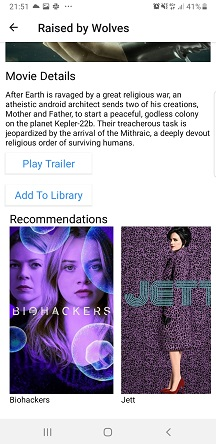

# Movie Review App Task for React Seals Kaunas Academy 

This app was made as an developer assignment to ReactSeals Academy.
Time given to complete the task was 1 week.

Finished the assignment wtih a solution for reviewing movies. Created a React Native application and integrated a 3rd party API for the content.

# Functionality

- Home page. Home page
- Browse page. Preview of three ore more movie lists sorted by different categories. For example: the most popular movies, the latest movies, movies that will soon be shown.
- Details page Detailed preview of a single movie and a related movies tab for the selected movie.
- Player page. Preview of the trailer of the selected movie.

# Requirements
- Use https://reactnative.dev/ framework
- Application should work on Android platform. If you have Mac iOS would be a bonus
- Fetch data from https://www.themoviedb.org/documentation/api
- Github for code version control

## To Start
1. Download the repo
2. run "npm install" or "yarn"
3. run "expo start --android" or "expo start --web" to start the project
4. (If you chose android)Download the expo app on your device and scan the given QR code or connect your device via usb to the computer

## Meta

Domantas Mikelionis - https://github.com/DomantasMk / https://www.linkedin.com/in/domantas-mikelionis-36aa84172/  

## APK
Or you can always download the APK,
download link: https://expo.io/artifacts/afb63608-5c9b-4cf2-a133-aea565a16632
